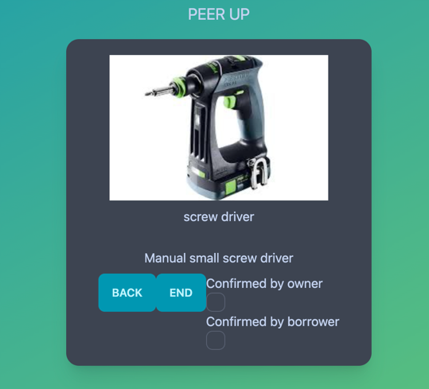

In this example we use Account Abstraction in ZkSync to create MultiSig account to end the offer

We have implemented all the scenario in a ts file
To execute the code:

1. `yarn install`  
2. `yarn hardhat deploy-zksync --script deploy-factory.ts` 
3. copy/paste the address of `factory` and assign it to `AA_FACTORY_ADDRESS` in `scenario.ts` file
4. `yarn hardhat deploy-zksync --script scenario.ts`

This scenario will do the following:
- 

## Example on the frontend:
- Both borrower and customer has to approve the endOffer through the multisig contract

